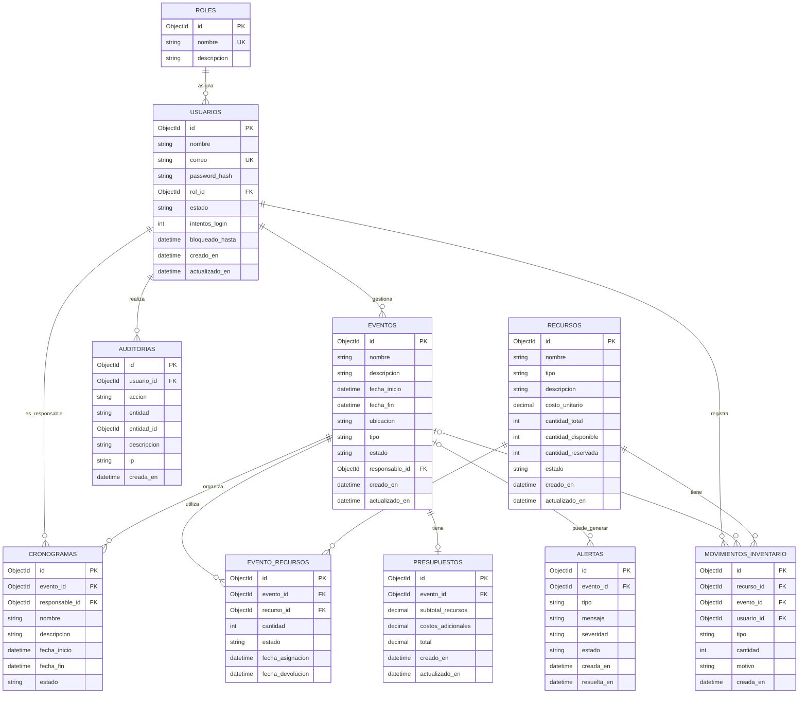

# Arquitectura y modelo de datos de EVORIA

Este documento define la base funcional que se implementará gradualmente en el
monorepo. Es una guía de diseño: no significa que todos los módulos estén
implementados todavía.

## Arquitectura actual

```text
apps/web             Next.js: interfaz, navegación y control visual de acceso
apps/api             NestJS: API, reglas de negocio y autorización
packages/contracts   Tipos compartidos entre web y API
MongoDB              Persistencia de los datos de negocio
Docker Compose       Entorno local completo
GitHub Actions       Validaciones de formato, calidad, compilación y Docker
```

La web no decide la seguridad. Puede ocultar páginas y acciones que no
correspondan al rol del usuario, pero la API debe validar el rol en cada
endpoint protegido.

## Roles y acceso

Los roles iniciales son fijos. Por ello, la colección `roles` solo identifica
el rol; no almacena una lista de permisos configurable. NestJS asociará cada
endpoint a los roles autorizados mediante guards.

| Rol           | Acceso previsto                                                                     |
| ------------- | ----------------------------------------------------------------------------------- |
| Administrador | Gestión completa de usuarios, eventos, recursos, presupuestos, alertas y auditoría. |
| Coordinador   | Gestión de eventos, cronogramas, recursos asignados, presupuestos y alertas.        |
| Empleado      | Consulta de eventos y recursos; actualización de actividades asignadas.             |
| Proveedor     | Consulta limitada de los eventos o recursos en los que participa.                   |

La web usará este mismo criterio para mostrar las rutas disponibles. Por
ejemplo, `auditoria` será exclusiva de Administración; `presupuestos` estará
disponible para Administración y Coordinación.

## Modelo de datos

El diagrama usa relaciones para explicar el dominio. En MongoDB los
identificadores serán `ObjectId`; las relaciones se implementarán como
referencias entre documentos.



## Decisiones del modelo

### Presupuesto

Cada evento puede tener un único presupuesto. `presupuestos.evento_id` debe ser
único para evitar que un evento tenga presupuestos duplicados.

No se incluye moneda en esta primera versión. Todos los valores monetarios se
manejarán bajo la moneda definida para el proyecto.

### Inventario

No se creará una colección llamada `inventario`. El estado actual está en
`recursos` mediante `cantidad_total`, `cantidad_disponible` y
`cantidad_reservada`.

`movimientos_inventario` conserva el historial de compras, ajustes,
asignaciones, devoluciones o daños. Así se evita tener dos fuentes de verdad
para las mismas cantidades.

### Reportes

Los reportes se generan mediante consultas a eventos, recursos, presupuestos,
alertas y auditorías. No se persisten inicialmente. Solo se añadirá una
colección de reportes si se requiere conservar exportaciones generadas, sus
filtros y su archivo.

## Reglas de negocio esenciales

- El correo de un usuario es único.
- Un evento debe tener fecha de finalización igual o posterior a su fecha de
  inicio.
- Una actividad del cronograma debe estar dentro del periodo de su evento.
- Las cantidades de un recurso nunca pueden ser negativas.
- No se puede asignar a un evento una cantidad mayor a la disponible.
- Asignar o devolver un recurso debe actualizar cantidades y crear su
  movimiento de inventario dentro de una transacción de MongoDB.
- Un recurso eliminado se desactiva si tiene historial; no se borra de forma
  física.
- Toda operación administrativa relevante debe crear una auditoría.

## Contrato general de la API

Las respuestas exitosas seguirán esta forma:

```json
{
  "data": {},
  "message": "Operación realizada correctamente"
}
```

Los errores usarán un código HTTP adecuado y una respuesta consistente:

```json
{
  "statusCode": 403,
  "message": "No tienes permisos para realizar esta acción",
  "error": "Forbidden"
}
```

## Endpoints previstos

Los endpoints se implementarán por módulos. Todos, salvo inicio de sesión,
deben requerir autenticación y validar los roles permitidos.

| Módulo        | Método y ruta                                  | Roles                                   | Respuesta esperada                                    |
| ------------- | ---------------------------------------------- | --------------------------------------- | ----------------------------------------------------- |
| Autenticación | `POST /api/auth/login`                         | Público                                 | Usuario autenticado y token o cookie de sesión.       |
| Autenticación | `GET /api/auth/me`                             | Todos                                   | Usuario actual y su rol.                              |
| Usuarios      | `GET /api/users`                               | Administrador                           | Lista paginada de usuarios.                           |
| Usuarios      | `POST /api/users`                              | Administrador                           | Usuario creado sin exponer `password_hash`.           |
| Eventos       | `GET /api/events`                              | Todos según alcance                     | Lista filtrable y paginada de eventos permitidos.     |
| Eventos       | `POST /api/events`                             | Administrador, Coordinador              | Evento creado.                                        |
| Eventos       | `GET /api/events/:id`                          | Usuarios autorizados                    | Detalle del evento, presupuesto y recursos asignados. |
| Eventos       | `PATCH /api/events/:id`                        | Administrador, Coordinador              | Evento actualizado.                                   |
| Eventos       | `DELETE /api/events/:id`                       | Administrador, Coordinador              | Evento cancelado o archivado.                         |
| Recursos      | `GET /api/resources`                           | Todos según alcance                     | Recursos y disponibilidad actual.                     |
| Recursos      | `POST /api/resources`                          | Administrador, Coordinador              | Recurso creado.                                       |
| Recursos      | `PATCH /api/resources/:id`                     | Administrador, Coordinador              | Recurso actualizado.                                  |
| Recursos      | `DELETE /api/resources/:id`                    | Administrador                           | Recurso desactivado.                                  |
| Asignaciones  | `POST /api/events/:id/resources`               | Administrador, Coordinador              | Recurso asignado y existencias actualizadas.          |
| Asignaciones  | `DELETE /api/events/:id/resources/:resourceId` | Administrador, Coordinador              | Asignación liberada y existencias actualizadas.       |
| Presupuesto   | `GET /api/events/:id/budget`                   | Administrador, Coordinador              | Presupuesto del evento.                               |
| Presupuesto   | `PUT /api/events/:id/budget`                   | Administrador, Coordinador              | Presupuesto actualizado.                              |
| Cronograma    | `GET /api/events/:id/schedules`                | Usuarios autorizados                    | Actividades del evento.                               |
| Cronograma    | `POST /api/events/:id/schedules`               | Administrador, Coordinador              | Actividad creada.                                     |
| Cronograma    | `PATCH /api/schedules/:id`                     | Administrador, Coordinador, responsable | Actividad actualizada.                                |
| Alertas       | `GET /api/alerts`                              | Administrador, Coordinador              | Alertas filtrables por estado y severidad.            |
| Alertas       | `PATCH /api/alerts/:id`                        | Administrador, Coordinador              | Alerta resuelta o actualizada.                        |
| Auditoría     | `GET /api/audit-logs`                          | Administrador                           | Registro paginado de acciones.                        |
| Dashboard     | `GET /api/dashboard/summary`                   | Todos según alcance                     | Métricas calculadas según el rol.                     |

## Orden de implementación

1. Autenticación, usuarios, roles y guards de NestJS.
2. Eventos y recursos, con DTOs, validaciones y autorización.
3. Asignación de recursos y movimientos de inventario transaccionales.
4. Presupuestos y dashboard.
5. Cronogramas, alertas y auditoría.
6. Reportes, exportaciones y pruebas automatizadas de los flujos anteriores.
